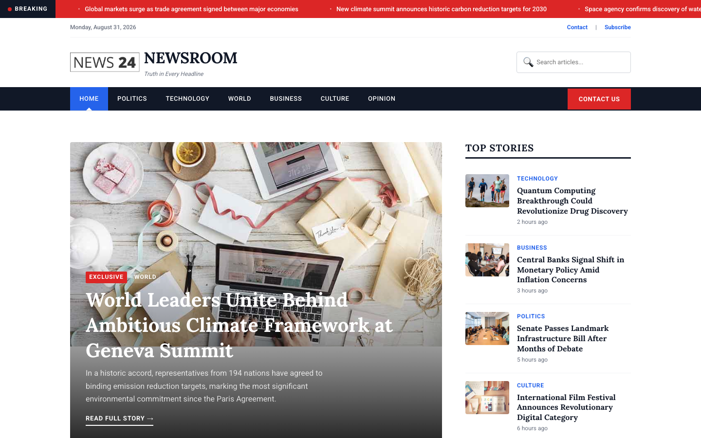

# NEWSROOM — News Portal & Journalism Template

**"Truth in Every Headline."**

A premium, responsive news portal template built with HTML, CSS, and vanilla JavaScript. Designed for news organizations, digital journalism outlets, and editorial publications that demand authoritative visual presence and flawless content hierarchy.

---

## 📸 Screenshot



## Live Pages

| Page | Description | File |
|------|-------------|------|
| Home | Featured hero story, category sections, trending sidebar, newsletter | [index.html](index.html) |
| Article | Full article page with author info, drop cap, share buttons, related stories | [article.html](article.html) |
| Category | Filterable article grid with category chips | [category.html](category.html) |
| Contact | Contact form with editorial office info, secure tip line, hours | [contact.html](contact.html) |

---

## Design Language

NEWSROOM draws its visual identity from broadsheet newspaper tradition adapted for digital. Key design signatures:

- **Breaking news ticker** with red label and infinite scroll animation
- **Newspaper rule-line dividers** (thick borders, double rules) establishing editorial hierarchy
- **Lora serif headings** paired with **Roboto sans-serif body** for authoritative readability
- **Drop cap first paragraphs** on article pages evoking print journalism
- **High-contrast dark header/nav** against clean white content areas
- **Numbered trending items** with oversized serif numerals
- **Newsletter section** with blue gradient and form validation

---

## Tech Stack

- **HTML5** semantic markup with ARIA attributes
- **CSS3** custom properties, CSS Grid, Flexbox, transitions
- **Vanilla JavaScript** — no frameworks, no dependencies
- **Google Fonts** — Lora (headings) + Roboto (body)
- **22 source images** in `assets/img/`

---

## Getting Started

1. Clone or download the project folder
2. Open `index.html` in any modern browser
3. All pages are fully standalone — no build step required

```bash
cd news-portal-html-template
open index.html
```

---

## Customization

### Colors

Edit the CSS custom properties in `assets/css/style.css`:

```css
:root {
  --c-dark:   #111827;  /* Primary dark */
  --c-blue:   #2563EB;  /* Accent blue */
  --c-accent: #DC2626;  /* Breaking news red */
  --c-gray:   #F3F4F6;  /* Background gray */
  --c-white:  #FFFFFF;  /* Content white */
}
```

### Typography

Swap fonts by updating the `@import` URL and the `--ff-heading` / `--ff-body` variables. Lora works well with any editorial serif; Roboto pairs cleanly with most sans-serif alternatives.

### Content

Replace images in `assets/img/` and update article text directly in the HTML files. All content is hard-coded for maximum performance and SEO.

---

## Features

- Breaking news ticker with CSS animation
- Sticky header with search
- Responsive burger menu (mobile)
- Category filter system (category page)
- Contact form with client-side validation
- Newsletter subscription form
- IntersectionObserver reveal animations
- `prefers-reduced-motion` support
- Print-friendly styles
- Semantic HTML with ARIA labels
- Dynamic year and date display

---

## File Structure

```
news-portal-html-template/
├── index.html          # Home page
├── article.html        # Full article page
├── category.html       # Category grid with filter
├── contact.html        # Contact form
├── README.md           # This file
└── assets/
    ├── css/
    │   └── style.css   # Full design system (500+ lines)
    ├── js/
    │   └── main.js     # All interactive behavior
    └── img/
        ├── logo.png
        ├── top-news-1.jpg ... top-news-5.jpg
        ├── cat-news-1.jpg ... cat-news-12.jpg
        ├── latest-news.jpg
        ├── popular-news.jpg
        └── adds-1.jpg, adds-2.jpg
```

---

## SEO Keywords

news portal, journalism template, news website, breaking news, editorial design, news homepage, article page, news category, responsive news, HTML news template, vanilla JS, newspaper design, digital journalism

---

## Browser Support

- Chrome 90+
- Firefox 88+
- Safari 14+
- Edge 90+

---

## License

Free for personal and commercial use. Attribution appreciated but not required.

---

Let's Build Something Together 🚀
https://tally.so/r/q4q1L9
